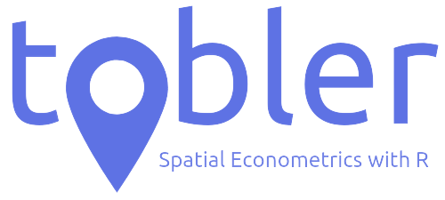

# tobler

Tobler is a web app that offers a intuitive step-by-step process for estimation of spatial econometric models, including a basic spatial visualization, creating of spatial weighting matrix and spatial correlation tests. Currently, it is possible to estimate several cross-section and panel models, with different estimators. Estimates of impacts are provided, when applicable.

This app was entirely created with R using the Shiny library. Spatial data is handled by the RGDAL, cleangeo and leaflet libraries. Spatial dependence tests and spatial models are provided by the spdep and spatialreg library.

The name is a tribute to the geographer Waldo R. Tobler and his First Law of Geography: "Everything is related to everything else, but near things are more related than distant things."

This is a prototype. All results must be checked and validated by the users.

Developers: Raphael Saldanha (Fiocruz); Eduardo Almeida (UFJF).
